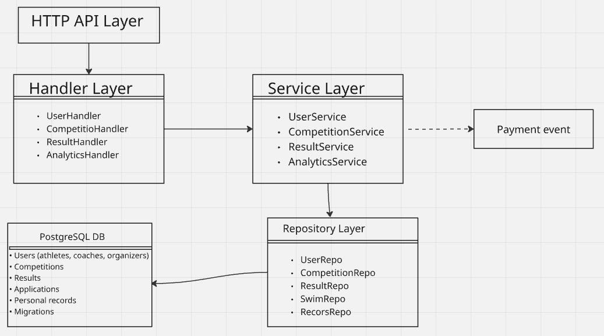

# Crazy Wave
Crazy Wave— платформа для спортсменов, тренеров и организаторов соревнований по плаванию. Спортсмены могут отслеживать свои результаты и прогресс, тренеры — управлять подопечными и анализировать статистику, организаторы — публиковать информацию о соревнованиях.

## Use Cases
### 1. Анализ прогресса спортсмена
Роль: Спортсмен/Тренер  
Сценарий: Спортсмен/Тренер хочет просмотреть график результатов на дистанции за соревновательный сезон, чтобы оценить прогресс и эффективность тренировочной программы.

### 2. Подача заявки на соревнование
Роль: Тренер  
Сценарий: Тренер отбирает своих спортсменов для участия в предстоящем мероприятии , заполняет заявку с указанием дистанций и стилей, и отправляет ее организаторам.

### 3. Внесение результатов заплыва
Роль: Организатор  
Сценарий: После завершения соревнований организатор вносит результаты спортсменов в систему, указывая время, занятое место и условия заплыва (бассейн 25/50м).

### 4. Поиск соревнований
Роль: Спортсмен  
Сценарий: Спортсмен ищет все ближайшие соревнования, чтобы спланировать сезон.

### 5. Создание нового соревнования
Роль: Организатор  
Сценарий: Организатор создает карточку нового соревнования: указывает дату, место, тип бассейна, список дистанций, сроки подачи заявок и регистрационные взносы.
